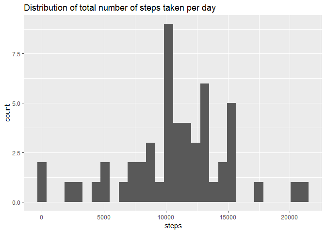
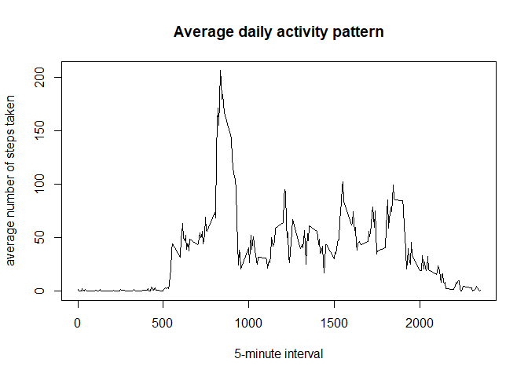
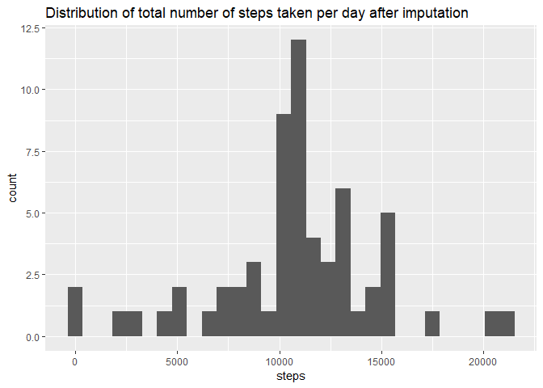
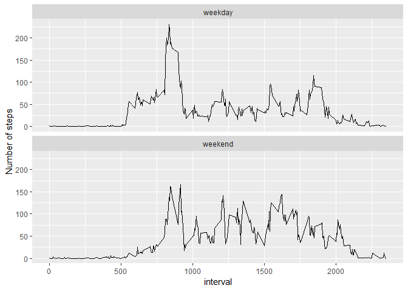

## Loading and preprocessing the data

```r
unzip("activity.zip")
act <- read.csv("activity.csv")
act$date <- as.Date(act$date)
```


## What is mean total number of steps taken per day?

```r
library(dplyr)
library(ggplot2)
stepsPerDay <-act %>% filter(!is.na(steps)) %>% group_by(date) %>% summarise(steps = sum(steps))
ggplot(data=stepsPerDay, aes(x=steps)) + geom_histogram() + ggtitle("Distribution of total number of steps taken per day")
```

<!-- -->


```r
res <-stepsPerDay  %>% summarise(meanSteps = mean(steps), medianSteps = median(steps) )
```

The mean total number of steps taken per day is 10766 and the median is 10765.

## What is the average daily activity pattern?


```r
dat <- act %>% filter(!is.na(steps)) %>% group_by(interval) %>% summarise(meansteps = mean(steps))
plot(x=dat$interval, y=dat$meansteps, type = "l", xlab = "5-minute interval", ylab = "average number of steps taken", main = "Average daily activity pattern")
```

<!-- -->

The maximum average number of steps is 206.17 during interval 835 

## Imputing missing values


```r
nmissing <- sum(is.na(act$steps))
```

There are 2304 missing values in the dataset


```r
# imputing the mean value for that 5-minute interval for missing values
actf <- act %>% inner_join(dat) %>% mutate(steps = ifelse(is.na(steps), round(meansteps), steps)) %>% select(-meansteps)
stepsPerDay2 <- actf %>% group_by(date) %>% summarise(steps = sum(steps))
ggplot(data=stepsPerDay2, aes(x=steps)) + geom_histogram() + ggtitle("Distribution of total number of steps taken per day after imputation")
```

<!-- -->


```r
res2 <- stepsPerDay2  %>% summarise(meanSteps = mean(steps), medianSteps = median(steps) )
```

The mean total number of steps taken per day after imputation is 10765 and the median is 10762. The impact of imputing the missing values is very limited.


## Are there differences in activity patterns between weekdays and weekends?


```r
Sys.setlocale("LC_ALL","English")
```

```
## [1] "LC_COLLATE=English_United States.1252;LC_CTYPE=English_United States.1252;LC_MONETARY=English_United States.1252;LC_NUMERIC=C;LC_TIME=English_United States.1252"
```

```r
actf$day <- factor(ifelse(weekdays(actf$date) %in% c("Saturday", "Sunday"),"weekend","weekday"))
dat2 <- actf %>% group_by(interval, day) %>% summarise(meansteps = mean(steps))
ggplot(dat2, aes(x=interval, y=meansteps)) + geom_line() + facet_wrap(~dat2$day, ncol = 1) + labs(y="Number of steps")
```

<!-- -->

